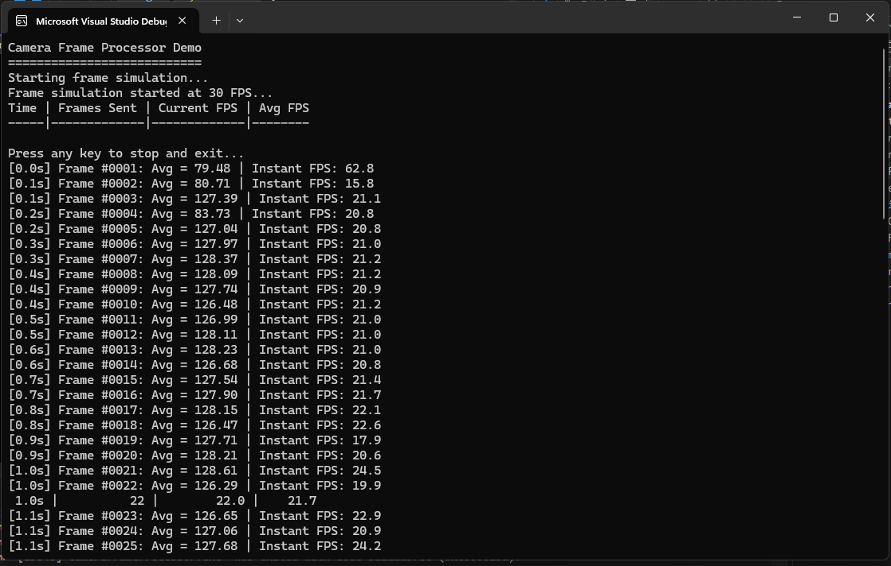

# Camera Frame Processor

A software intern was tasked with writing a program to:

- Fetch frames from the camera using `IFrameCallback`.
- Calculate the average pixel value of each frame.
- Stream the calculated value to the `IValueReporter` for real-time charting.
          
## Code Review Analysis

After reviewing the intern's code, I've identified several significant issues and areas for improvement.

### 1. Assessment of the Intern's Code

The intern demonstrates a basic understanding of the requirements but has implemented a flawed solution with several critical issues:

**Positives:**
- Correctly implements the required interfaces
- Shows understanding of event-driven architecture
- Attempts to handle frame buffering
- Includes proper disposal pattern for Frame class

**Major Issues:**
- **Memory Management Problems**: The code has serious memory leaks and buffer reuse issues
- **Threading Issues**: No thread safety considerations
- **Performance Problems**: Inefficient timer-based processing
- **Design Flaws**: Incorrect abstraction and coupling

### 2. Specific Problems Identified

#### Memory Management Issues:
- **Buffer Reuse Problem**: The `_buffer` in `FrameGrabber` is reused, but `Frame` objects hold references to the same buffer
- **Race Conditions**: Multiple frames may reference the same buffer data
- **Memory Leaks**: Frames are disposed immediately after enqueueing, making them unusable

#### Threading Problems:
- **No Synchronization**: Queue operations are not thread-safe
- **Timer vs Callback Mismatch**: Using a timer instead of processing frames as they arrive
- **Blocking Operations**: Potential for blocking the native callback thread

#### Design Issues:
- **Unnecessary Complexity**: The timer-based approach adds complexity without benefit
- **Poor Abstraction**: `FrameGrabber` shouldn't know about `Frame` objects
- **Tight Coupling**: Components are unnecessarily coupled

### 3. How to Improve the Code

#### Immediate Fixes:
1. **Fix Buffer Management**: Create new buffer for each frame
2. **Add Thread Safety**: Use concurrent collections or proper locking
3. **Remove Timer**: Process frames directly in callback
4. **Fix Disposal**: Don't dispose frames immediately

#### Design Improvements:
1. **Simplify Architecture**: Remove unnecessary abstraction layers
2. **Improve Performance**: Use unsafe code for faster pixel processing
3. **Add Error Handling**: Handle edge cases and exceptions
4. **Better Resource Management**: Implement proper cleanup

### Key Improvements in the New Implementation:

1. **Simplified Architecture**: Removed unnecessary abstractions and complexity
2. **Proper Memory Management**: Each frame gets its own buffer copy
3. **Thread Safety**: Uses ThreadPool for background processing
4. **Performance Optimization**: Optional unsafe code for faster processing
5. **Error Handling**: Proper exception handling and resource cleanup
6. **Frame Dropping**: Skips frames when processing is behind to maintain real-time performance
7. **Resource Efficiency**: No timers or queues, direct processing
8. **Better Separation of Concerns**: Clear, focused responsibilities

# Implementation Overview
 
This project implements a camera frame processing system that:
- Receives frames from a camera interface (simulated)
- Calculates the average pixel value of each frame
- Reports the results in real-time
- Monitors and displays frame rate performance

## Architecture

The application follows a clean, modular architecture with separated concerns:

### Core Interfaces
- **IFrameCallback**: Interface for receiving camera frames
- **IValueReporter**: Interface for reporting calculated values

### Main Components
- **CameraFrameProcessor**: Main processor that handles frame reception and pixel value calculation
- **FrameSimulator**: Simulates camera frames for testing and demonstration
- **ConsoleValueReporter**: Displays results and FPS information to console

## Project Structure

```
CameraFrameProcessor/
├── CameraFrameProcessor.cs     # Main frame processing logic
├── FrameSimulator.cs           # Camera frame simulation
├── ConsoleValueReporter.cs     # Console output and FPS tracking
├── IFrameCallback.cs           # Frame callback interface
├── IValueReporter.cs           # Value reporting interface
├── Program.cs                  # Application entry point
└── README.md                   # This file
```

## Features

### Frame Processing
- **Real-time Processing**: Processes frames as they arrive from the camera
- **Thread Safety**: Uses ThreadPool for non-blocking frame processing
- **Memory Management**: Proper handling of unmanaged memory pointers
- **Frame Skipping**: Skips frames when processing is behind to maintain real-time performance

### Performance Monitoring
- **FPS Tracking**: Real-time frame rate calculation and display
- **Frame Counting**: Sequential frame numbering
- **Timing Information**: Elapsed time display
- **Performance Statistics**: Average pixel values per frame

### Simulation
- **30 FPS Simulation**: Generates frames at 30 frames per second
- **Random Data**: Creates realistic frame data with random pixel values
- **Configurable Size**: 100x100 pixel frames (easily configurable)

## Usage

### Running the Application

1. **Build the project**:
   ```bash
   dotnet build
   ```

2. **Run the application**:
   ```bash
   dotnet run
   ```

3. **Expected Output**:


  

### Integration with Real Camera

To integrate with a real camera system:

1. **Implement IFrameCallback** in your camera interface
2. **Replace FrameSimulator** with your camera library
3. **Call FrameReceived()** when new frames arrive

```csharp
// Example integration
IValueReporter reporter = new ConsoleValueReporter();
IFrameCallback processor = new CameraFrameProcessor(reporter);

// Register with your camera library
yourCameraLibrary.RegisterCallback(processor);
```

## Technical Details

### Frame Processing Algorithm

1. **Frame Reception**: Receives frame pointer, width, and height
2. **Memory Copy**: Copies frame data from unmanaged to managed memory
3. **Pixel Calculation**: Iterates through all pixels to calculate sum
4. **Average Calculation**: Divides sum by total pixel count
5. **Result Reporting**: Sends result to configured reporter

### Performance Considerations

- **Non-blocking**: Frame processing happens on background threads
- **Memory Efficient**: Immediate copying prevents buffer reuse issues
- **Frame Dropping**: Skips frames when processing can't keep up
- **Thread Safe**: Uses proper locking for shared resources

### Memory Management

- **Unmanaged Memory**: Properly handles IntPtr frame pointers
- **Automatic Cleanup**: Uses try-finally blocks for resource cleanup
- **No Memory Leaks**: Careful management of allocated memory

## Configuration

### Frame Simulation Settings

```csharp
// In FrameSimulator.cs
private const int FRAME_WIDTH = 100;     // Frame width in pixels
private const int FRAME_HEIGHT = 100;    // Frame height in pixels
private const int FPS_INTERVAL = 33;     // 33ms = 30 FPS
```

### Reporter Settings

```csharp
// In ConsoleValueReporter.cs
private const double FPS_UPDATE_INTERVAL = 1.0; // Update FPS every second
```

## Requirements

- **.NET Framework 4.7.2** or higher
- **Windows** operating system
- **Visual Studio 2017** or higher (recommended)

## Building

### Visual Studio
1. Open `CameraFrameProcessor.csproj`
2. Build → Build Solution (Ctrl+Shift+B)

### Command Line
```bash
# Build
msbuild CameraFrameProcessor.csproj

# Or using dotnet CLI
dotnet build
```

## Testing

The application includes built-in testing through the frame simulator:

- **Automated Frame Generation**: Creates test frames automatically
- **Performance Verification**: Monitors actual vs expected FPS
- **Visual Feedback**: Console output shows processing results

## Future Enhancements

- **Multiple Camera Support**: Handle multiple camera streams
- **Image Filters**: Add image processing filters
- **File Output**: Save processed results to files
- **GUI Interface**: Replace console with graphical interface
- **Performance Metrics**: Add detailed performance analytics
- **Configuration File**: External configuration support
