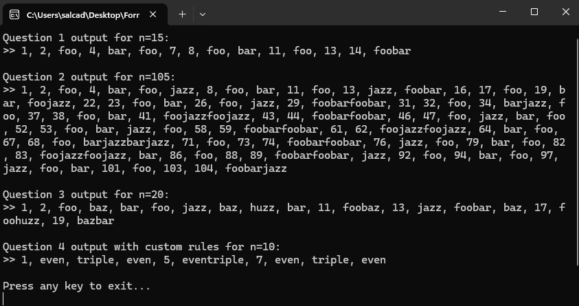

# CodingCompetency - Number Generator

A flexible C# console application that implements a customizable number generator with rule-based output substitution.

## Features

- **Flexible Rule System**: Add custom rules with `AddRule(divisor, output)` method
- **Priority Handling**: Exact matches take highest priority, followed by divisibility rules in ascending order
- **Multiple Rule Combinations**: Automatically concatenates outputs when multiple divisibility rules apply
- **Clean API**: Simple interface for adding rules and generating sequences

## Project Structure

```
CodingCompetency/
├── Program.cs           # Main entry point with test cases
├── NumberGenerator.cs   # Core logic for rule-based number generation
├── CodingCompetency.csproj  # Project configuration
├── App.config          # Application configuration
├── README.md           # This file
└── Screenshot.png      # Example output
```

## How It Works

The <mcfile name="NumberGenerator.cs" path="c:\Users\salcad\Desktop\FormulatrixHomework\CodingCompetency\NumberGenerator.cs"></mcfile> class provides:

1. **AddRule(int divisor, string output)**: Adds a new rule to the generator
2. **Generate(int number)**: Applies rules to a single number
3. **PrintSequence(int n)**: Generates and prints sequence from 1 to n

### Rule Priority

1. **Exact Match**: If a number exactly matches a rule key, return that rule's output
2. **Divisibility**: Check all rules in ascending order; concatenate outputs for all matching divisors
3. **Default**: If no rules apply, return the number as string

## Usage Examples

The <mcfile name="Program.cs" path="c:\Users\salcad\Desktop\FormulatrixHomework\CodingCompetency\Program.cs"></mcfile> demonstrates four different test cases:

### Question 1: Basic FizzBuzz
```csharp
NumberGenerator gen1 = new NumberGenerator();
gen1.AddRule(3, "foo");
gen1.AddRule(5, "bar");
gen1.AddRule(15, "foobar");
gen1.PrintSequence(15);
```

### Question 2: Extended Rules
```csharp
NumberGenerator gen2 = new NumberGenerator();
gen2.AddRule(3, "foo");
gen2.AddRule(5, "bar");
gen2.AddRule(7, "jazz");
gen2.AddRule(15, "foobar");
gen2.AddRule(21, "foojazz");
gen2.AddRule(35, "barjazz");
gen2.AddRule(105, "foobarjazz");
gen2.PrintSequence(105);
```

### Question 3: Multiple Divisors
```csharp
NumberGenerator gen3 = new NumberGenerator();
gen3.AddRule(3, "foo");
gen3.AddRule(4, "baz");
gen3.AddRule(5, "bar");
gen3.AddRule(7, "jazz");
gen3.AddRule(9, "huzz");
gen3.PrintSequence(20);
```

### Question 4: Custom Rules
```csharp
NumberGenerator gen4 = new NumberGenerator();
gen4.AddRule(2, "even");
gen4.AddRule(3, "triple");
gen4.PrintSequence(10);
```

## Example Output



The screenshot above shows the console output for all four test cases, demonstrating how the number generator handles different rule combinations and priorities.

## Requirements

- .NET Framework 4.7.2 or higher
- Visual Studio 2017 or later (or any C# compiler)

## Building and Running

1. Open the solution in Visual Studio
2. Build the project (Ctrl+Shift+B)
3. Run the application (F5 or Ctrl+F5)

Alternatively, using command line:
```bash
msbuild CodingCompetency.csproj
CodingCompetency.exe
```

## Key Implementation Details

- **Dictionary-based Rules**: Uses `Dictionary<int, string>` for O(1) exact match lookup
- **Ordered Processing**: Divisibility rules are processed in ascending order for consistent output
- **StringBuilder**: Efficient string concatenation for multiple rule matches
- **Separation of Concerns**: Clean separation between rule management and sequence generation

This implementation provides a robust, extensible solution that can handle various FizzBuzz-like problems with custom rules and complex combinations.
        