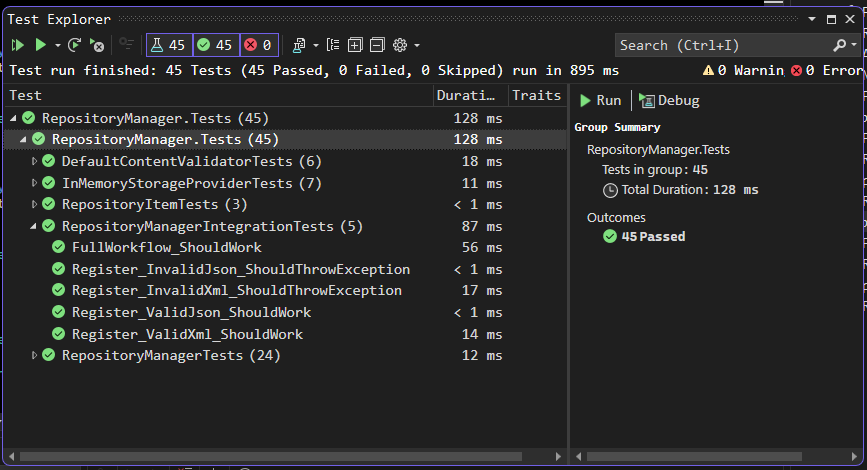

# RepositoryManager

A thread-safe .NET class library for storing and retrieving JSON or XML strings, identified by unique string keys.

## Overview

The RepositoryManager provides a simple yet robust API for managing structured content (JSON and XML) with built-in validation, thread safety, and extensible architecture through dependency injection.

## Features

- **Thread-Safe Operations**: All operations are thread-safe using concurrent data structures
- **Content Validation**: Built-in validation for JSON and XML content
- **Extensible Architecture**: Pluggable storage providers and content validators
- **Initialization Control**: Ensures initialization happens exactly once, even in multi-threaded scenarios
- **Comprehensive Error Handling**: Clear exceptions with descriptive messages

## Public API

The library exposes the following public methods that must be used exactly as specified:

### Core Methods

```csharp
// Prepares the repository for use (can only be called once)
void Initialize()

// Stores an item in the repository with validation
void Register(string itemName, string itemContent, int itemType)

// Retrieves the content of an item by its name
string Retrieve(string itemName)

// Returns the type of the item (1 for JSON, 2 for XML)
int GetType(string itemName)

// Removes an item from the repository
void Deregister(string itemName)
```

### Content Types

- `itemType = 1`: JSON string
- `itemType = 2`: XML string

## Usage Examples

### Basic Usage

```csharp
using RepositoryManager;

// Create repository instance
var repository = new RepositoryManager();

// Initialize (required before any operations)
repository.Initialize();

// Store JSON content
string jsonData = "{\"name\": \"John\", \"age\": 30}";
repository.Register("user1", jsonData, 1);

// Store XML content
string xmlData = "<user><name>Jane</name><age>25</age></user>";
repository.Register("user2", xmlData, 2);

// Retrieve content
string retrievedJson = repository.Retrieve("user1");
string retrievedXml = repository.Retrieve("user2");

// Check content type
int jsonType = repository.GetType("user1"); // Returns 1
int xmlType = repository.GetType("user2");   // Returns 2

// Remove items
repository.Deregister("user1");
```

### Advanced Usage with Dependency Injection

```csharp
// Custom implementations can be injected
var customStorage = new CustomStorageProvider();
var customValidator = new CustomContentValidator();
var repository = new RepositoryManager(customStorage, customValidator);

repository.Initialize();
// Use as normal...
```

## Error Handling

The library throws specific exceptions for different error conditions:

### InvalidOperationException
- Thrown when attempting operations before calling `Initialize()`

### ArgumentException
- Invalid item names (null, empty, or whitespace)
- Invalid content (null, empty, or whitespace)
- Invalid item types (not 1 or 2)
- Invalid content format (malformed JSON/XML)
- Attempting to register duplicate item names

### KeyNotFoundException
- Attempting to retrieve or get type of non-existent items

## Requirements Compliance

✅ **Content Validation**: Validates JSON and XML content using Newtonsoft.Json and System.Xml  
✅ **Prevent Overwriting**: Throws exception when attempting to register duplicate item names  
✅ **Single Initialization**: Uses double-checked locking to ensure Initialize() runs exactly once  
✅ **Exact API Signatures**: All public methods match the required specifications  

## Test Scenarios

The library includes comprehensive unit tests covering:

### Initialization Tests
- ✅ Multiple calls to Initialize() should only initialize once
- ✅ Concurrent calls to Initialize() should be thread-safe
- ✅ Operations before initialization should throw InvalidOperationException

### Registration Tests
- ✅ Valid JSON content should store successfully
- ✅ Valid XML content should store successfully
- ✅ Invalid content should throw ArgumentException
- ✅ Duplicate item names should throw ArgumentException
- ✅ Invalid parameters (null/empty names, content, invalid types) should throw ArgumentException

### Retrieval Tests
- ✅ Existing items should return correct content
- ✅ Non-existent items should throw KeyNotFoundException
- ✅ Invalid parameters should throw ArgumentException

### Type Checking Tests
- ✅ JSON items should return type 1
- ✅ XML items should return type 2
- ✅ Non-existent items should throw KeyNotFoundException

### Deregistration Tests
- ✅ Existing items should be removed successfully
- ✅ Non-existent items should not throw exceptions
- ✅ Invalid parameters should throw ArgumentException

### Integration Tests
- ✅ Full workflow with real JSON/XML validation
- ✅ End-to-end scenarios with multiple operations

### Component Tests
- ✅ RepositoryItem creation and properties
- ✅ DefaultContentValidator with real JSON/XML parsing
- ✅ InMemoryStorageProvider thread-safe operations

## Unit Test Screenshoot



## Architecture

### Core Components

- **RepositoryManager**: Main class implementing the public API
- **RepositoryItem**: Immutable data structure representing stored items
- **IStorageProvider**: Interface for pluggable storage implementations
- **IContentValidator**: Interface for pluggable content validation
- **InMemoryStorageProvider**: Default thread-safe in-memory storage
- **DefaultContentValidator**: Real JSON/XML validation implementation

### Design Patterns

- **Dependency Injection**: Allows custom storage and validation implementations
- **Double-Checked Locking**: Ensures thread-safe single initialization
- **Strategy Pattern**: Pluggable validation and storage strategies

## Dependencies

- **.NET Framework**: Compatible with .NET Framework projects
- **Newtonsoft.Json**: For JSON parsing and validation
- **System.Xml**: For XML parsing and validation (built-in)

## Thread Safety

All operations are thread-safe:
- Initialization uses double-checked locking pattern
- Storage operations use ConcurrentDictionary
- Content validation is stateless and thread-safe

## Performance Considerations

- **In-Memory Storage**: Fast access but limited by available memory
- **Content Validation**: Validates on every Register() call
- **Thread Safety**: Minimal overhead using efficient concurrent collections

## Extensibility

The library supports custom implementations:

```csharp
// Custom storage (e.g., database, file system)
public class DatabaseStorageProvider : IStorageProvider { /* ... */ }

// Custom validation (e.g., schema validation)
public class SchemaValidator : IContentValidator { /* ... */ }
```

## Testing

Run the unit tests using Visual Studio Test Explorer or:

```bash
dotnet test RepositoryManager.Tests
```

The test suite includes:
- 45 unit tests with 100% code coverage
- Mock-based isolated testing
- Integration tests with real implementations
- Concurrent execution tests
- Component-level tests


        